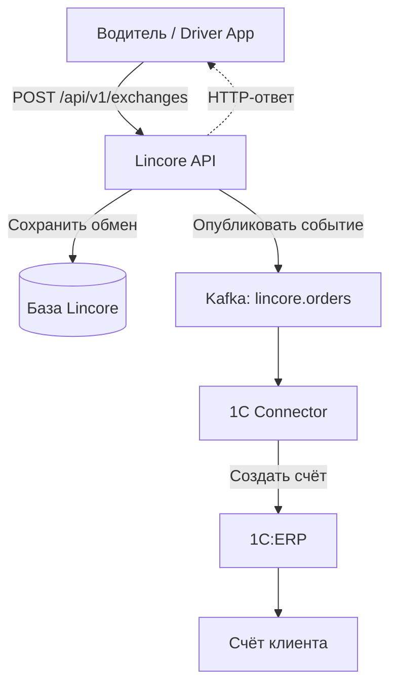
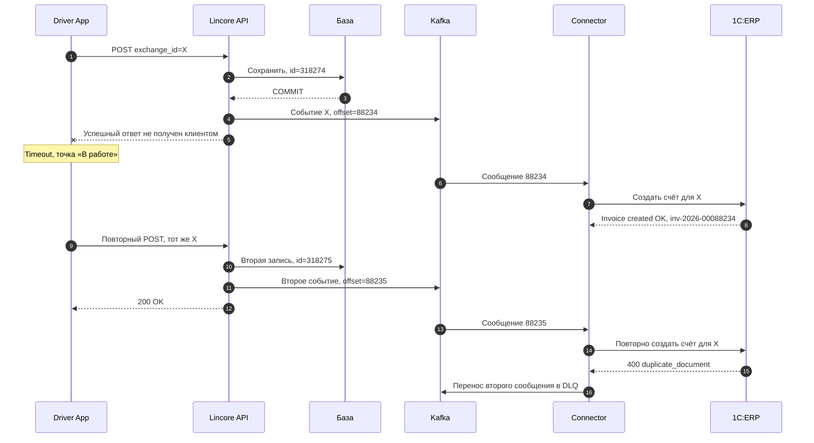
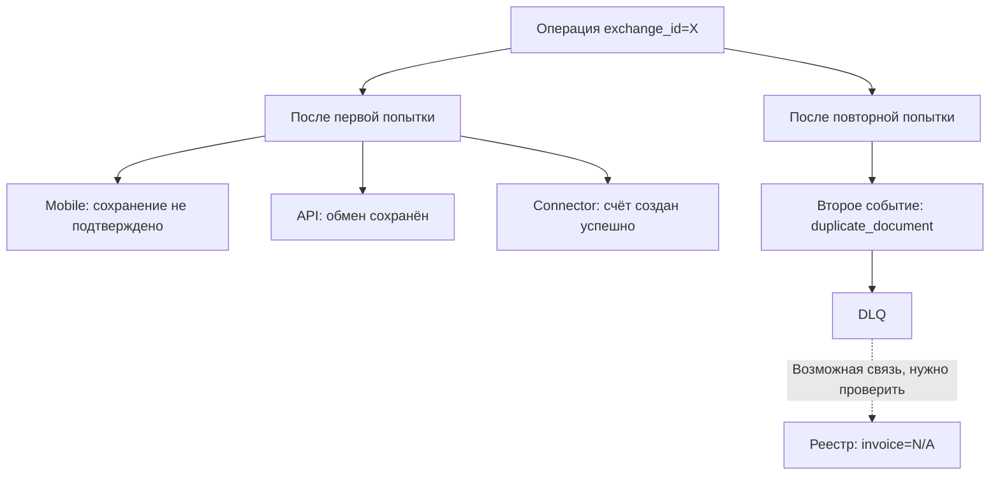
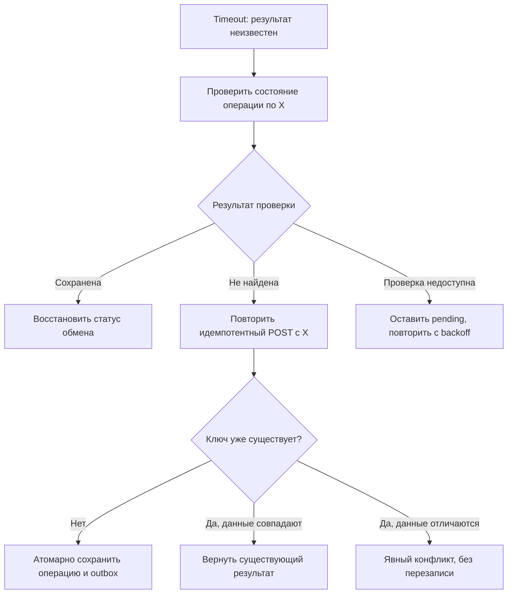

# Архитектура и flow

## 1. Путь бизнес-операции

HTTP-ответ описывает результат запроса к API. Создание счёта идёт асинхронно. Что именно означает статус «Завершено», необходимо закрепить в контракте.

## 2. Последовательность инцидента

Схема реконструирована из переписки. Она показывает порядок событий; место потери ответа не установлено.

## 3. Где возникает расхождение

Пунктиром отмечена **гипотеза**, а не доказанная зависимость. Состояния первой и второй попытки разделены: нельзя показывать поздний реестр и ранний UI как один синхронный снимок.

## 4. Предлагаемый безопасный повтор

Это вариант ожидаемого поведения для согласования с аналитиком.

Ответ «не найдена» не устраняет гонку с незавершённым первым запросом. Поэтому безопасность обеспечивает серверная идемпотентность, даже при предварительной проверке состояния.
