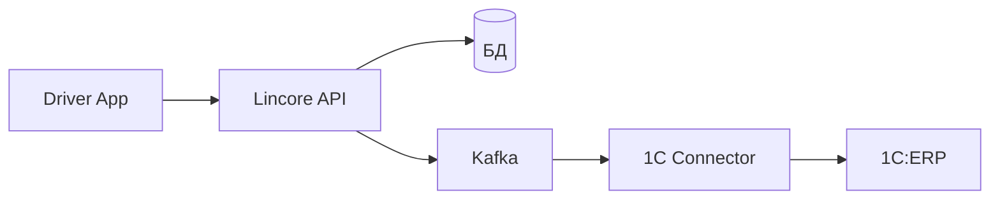
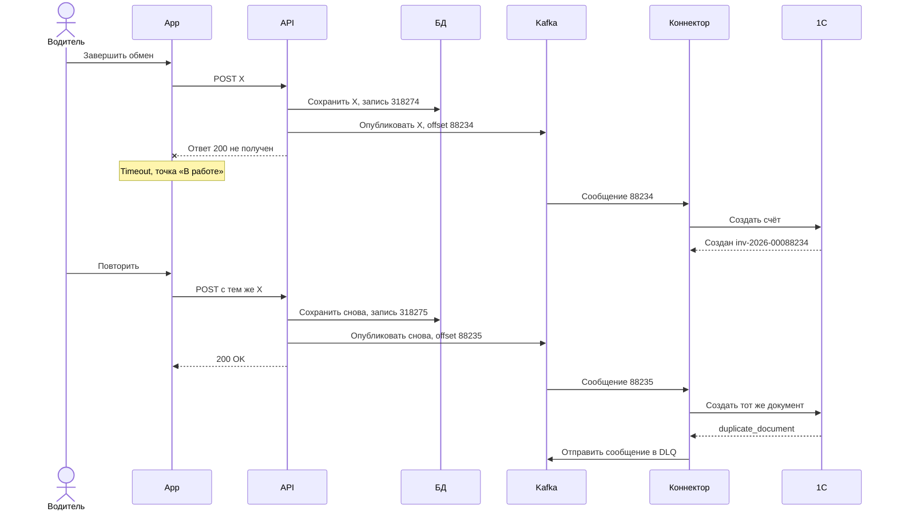

# Задача 1. Анализ инцидента

## Мои предположения

- Оба запроса с `exchange_id=ex-20260824-0010482` относятся к одному обмену и содержат одинаковые данные.
- Время событий разных компонентов сопоставимо.
- Успешный ответ создания счёта относится к этой операции. Актуальное состояние документа и причину расхождения с реестром нужно проверить отдельно.

Данные ниже перенесены из предоставленной переписки. Статусы гипотез относятся к описанным в ней логам; оригиналы ещё нужно сверить. [Исходные материалы](sources.md).

## Схема взаимодействия

Приложение получает ответ от Lincore, а счёт создаётся асинхронно через Kafka и коннектор.

**Ключевой момент:** первое сообщение создало счёт до повторного нажатия водителя. Место потери HTTP-ответа пока не установлено.

## 1. Гипотезы

| Слой | Гипотеза | Что подтверждает | Статус |
|---|---|---|---|
| H1 · Клиент | Первый запрос выполнился, но приложение не получило подтверждение и оставило точку «В работе» | Timeout на клиенте, успешная обработка на backend | Подтверждено по описанным логам |
| H2 · Сеть | HTTP-ответ не дошёл до приложения или соединение закрылось до его получения | `client connection closed before response sent` | Частично подтверждено |
| H3 · Backend | Повторный POST с тем же `exchange_id` обработан как новая операция | Две записи БД для одного `exchange_id` | Подтверждено по описанным логам |
| H4 · БД и производительность | Lock wait увеличил время обработки | `lock wait 4120 ms` | Фактор риска |
| H5 · Интеграция с 1С | Повторное событие получило `duplicate_document` и ушло в DLQ, хотя счёт уже существовал | Успех первого сообщения, `duplicate_document` и DLQ для второго | Подтверждено по описанным логам |
| H6 · Данные и отчётность | Финансовый реестр показывает `invoice=N/A`, несмотря на успешное создание счёта первым сообщением | Ответ об успешном создании invoice и N/A в реестре | Требует проверки |

**Клиент и backend.** Первый запрос на сервере прошёл успешно, но приложение об этом не узнало. После timeout водитель повторил действие. Backend не распознал повтор уже выполненной операции: для одного `exchange_id` появились две записи и два сообщения Kafka. Два сообщения здесь — следствие повторной обработки на backend, а не отдельная первопричина.

**Интеграция.** Первое сообщение создало счёт, второе получило ошибку, потому что такой документ уже существовал. Нужно проверить, относится ли найденный счёт к тому же обмену и совпадают ли данные. Отдельно хочу выяснить, почему отчётность считает операцию ошибочной: связь между DLQ и `invoice=N/A` пока не доказана.

**БД.** Ожидание блокировки около четырёх секунд увеличило задержку, но само по себе не объясняет клиентский timeout около 30 секунд. Считаю его возможным фактором нестабильности, а не доказанной причиной инцидента.

Повторные запросы в распределённой системе ожидаемы, поэтому операция должна быть безопасной при retry.

## 2. Анализ артефактов

### Артефакт A · Спецификация

- Проверяю контракт успешного завершения операции.
- Ищу требования к timeout и retry.
- Ищу требования к идемпотентности.
- Проверяю правила уникальности `exchange_id`.
- Уточняю, когда точка считается «Завершено».

### Артефакт B · Логи

- Коррелирую события по `exchange_id`, `traceId` и Kafka offset с учётом topic и partition.
- Восстанавливаю последовательность событий — она показана на схеме выше.
- Сравниваю состояние клиента и backend после первой попытки.
- Проверяю количество записей одного `exchange_id` и данные обоих запросов.
- Проверяю обработку двух Kafka-сообщений и результат каждого вызова 1С.
- Сравниваю состояние документа в 1С с финансовым реестром.

### Артефакт C · Скриншот

- Проверяю состояние точки после timeout.
- Проверяю доступность повторного нажатия «Завершить обмен».
- Сверяю количество ковров с логами.
- Проверяю текст ошибки: не вводит ли он пользователя в заблуждение относительно фактического результата операции.

Скриншот подтверждает состояние приложения, но не доказывает отсутствие сохранённого обмена или счёта в 1С.

## 3. Предварительное заключение

По описанным логам первый запрос на завершение обмена фактически выполнился успешно: Lincore сохранил exchange, отправил событие в Kafka, а 1С создала счёт `inv-2026-00088234`. Однако приложение не получило HTTP-ответ и оставило точку в статусе «В работе».

После повторного нажатия приложение отправило тот же `exchange_id` ещё раз. Backend создал вторую запись и второе Kafka-сообщение. При обработке повторного события 1С обнаружила уже существующий документ, вернула `duplicate_document`, после чего сообщение было отправлено в DLQ.

Поэтому предварительно считаю основной проблемой отсутствие идемпотентной обработки повторного запроса. Согласно логам, счёт в 1С был создан первым сообщением. Дополнительно требуется проверить документ и выяснить, почему финансовый реестр показывает `invoice=N/A` и считает операцию неуспешной.

## 4. Вопросы аналитику

1. **Как должен обрабатываться повторный POST с тем же `exchange_id` после timeout и должен ли он быть идемпотентным?**

    Подпункт: может ли один `client_id` обслуживаться несколько раз в сутки? Это влияет на уникальность формата `ex-{YYYYMMDD}-{client_id}`. Это риск требования, а не установленная причина данного инцидента.

2. **В какой момент обмен считается завершённым: после сохранения в Lincore или после успешного создания счёта в 1С?**

3. **Как определяется итоговый статус счёта, если для одного `exchange_id` есть успешное создание документа и последующее duplicate-сообщение в DLQ?**
